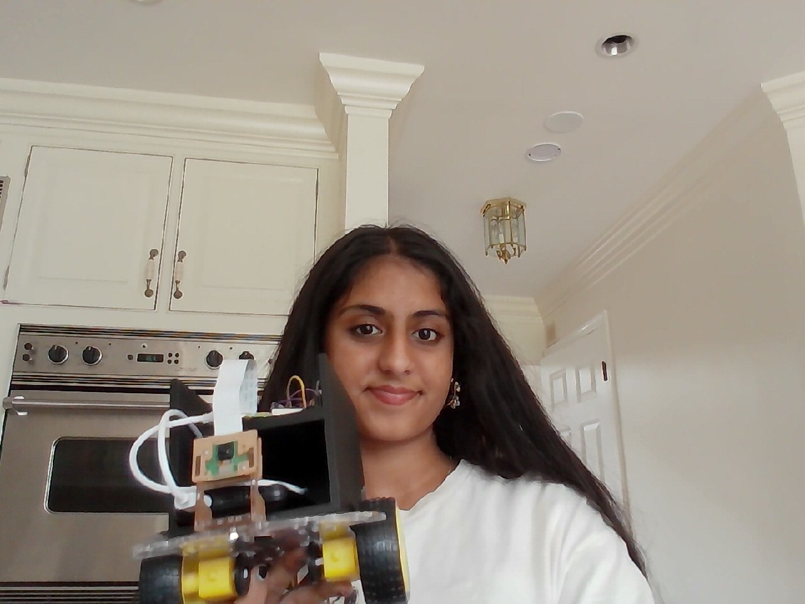
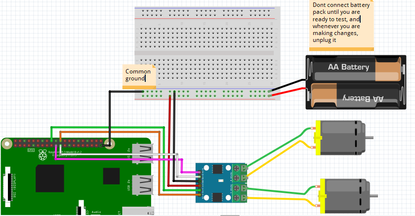
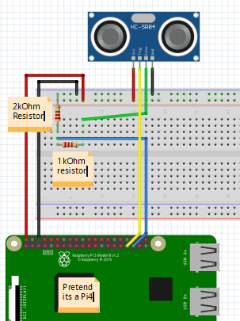

# Ball-Tracking Robot
Out of all the wonderful projects that I could have completed, I picked a ball-tracking robot because it seemed like a perfect mix of fun and challenging. Although I had to overcome plenty of obstacles, building a robot that could succesfully detect and follow a moving ball was an incredibly rewarding first project. 


| **Engineer** | **School** | **Area of Interest** | **Grade** |
|:--:|:--:|:--:|:--:|
| Simmren O | Centennial High School | Mechanical Engineering | Incoming Sophomore



  
# Final Milestone

For my final milestone, I built the robot chassis and completed all the wiring for the motors. I also initiated several tests and tweaked the code until my robot was functional. Finally, I made my modification by designing and 3D printing a case where I could organize all of the components efficiently on top of the robot base.

<iframe width="560" height="315" src="https://www.youtube.com/embed/c7E3q7lLxJA?si=4xoVzWWSj6-GcNTr" title="YouTube video player" frameborder="0" allow="accelerometer; autoplay; clipboard-write; encrypted-media; gyroscope; picture-in-picture; web-share" referrerpolicy="strict-origin-when-cross-origin" allowfullscreen></iframe>


# First Milestone

My first milestone consisted of me completing the wiring for my robot's sensors and setting up my Raspberry Pi on my computer and uploading all the code. Although I faced some issues with connecting the Raspberry Pi to my computer via SSH, I was finally able to connect it remotely by using a monitor. 

<iframe width="560" height="315" src="https://www.youtube.com/embed/fauM9rYn7co?si=fEdKp20YEWjZHdk7" title="YouTube video player" frameborder="0" allow="accelerometer; autoplay; clipboard-write; encrypted-media; gyroscope; picture-in-picture; web-share" referrerpolicy="strict-origin-when-cross-origin" allowfullscreen></iframe>

# Schematics 





# Code

```c++
# import the necessary packages
from picamera2 import Picamera2
import RPi.GPIO as GPIO
import time
import cv2
import numpy as np

#hardware work
GPIO.setmode(GPIO.BOARD)

MOTOR1B=21  #Left Motor
MOTOR1E=19

MOTOR2B=22  #Right Motor
MOTOR2E=18 

LED_PIN = 13  #If it finds the ball, then it will light up the led

GPIO.setup(MOTOR1B, GPIO.OUT)
GPIO.setup(MOTOR1E, GPIO.OUT)
GPIO.setup(MOTOR2B, GPIO.OUT)
GPIO.setup(MOTOR2E, GPIO.OUT)
GPIO.setup(LED_PIN, GPIO.OUT)

def forward():
      GPIO.output(MOTOR1B, GPIO.HIGH)
      GPIO.output(MOTOR1E, GPIO.LOW)
      GPIO.output(MOTOR2B, GPIO.HIGH)
      GPIO.output(MOTOR2E, GPIO.LOW)

def reverse():
      GPIO.output(MOTOR1B, GPIO.LOW)
      GPIO.output(MOTOR1E, GPIO.HIGH)
      GPIO.output(MOTOR2B, GPIO.LOW)
      GPIO.output(MOTOR2E, GPIO.HIGH)

def leftturn():
      GPIO.output(MOTOR1B, GPIO.LOW)
      GPIO.output(MOTOR1E, GPIO.HIGH)
      GPIO.output(MOTOR2B, GPIO.HIGH)
      GPIO.output(MOTOR2E, GPIO.LOW)

def rightturn():
      GPIO.output(MOTOR1B, GPIO.HIGH)
      GPIO.output(MOTOR1E, GPIO.LOW)
      GPIO.output(MOTOR2B, GPIO.LOW)
      GPIO.output(MOTOR2E, GPIO.HIGH)

def stop():
      GPIO.output(MOTOR1E, GPIO.LOW)
      GPIO.output(MOTOR1B, GPIO.LOW)
      GPIO.output(MOTOR2E, GPIO.LOW)
      GPIO.output(MOTOR2B, GPIO.LOW)

#Image analysis work
def segment_colour(frame):    #returns only the red colors in the frame
    hsv_roi = cv2.cvtColor(frame, cv2.COLOR_BGR2HSV)
    mask_1 = cv2.inRange(hsv_roi, np.array([160, 160, 10]), np.array([180, 255, 255]))
    ycr_roi = cv2.cvtColor(frame, cv2.COLOR_BGR2YCrCb)
    mask_2 = cv2.inRange(ycr_roi, np.array((0., 165., 0.)), np.array((255., 255., 255.)))
    mask = mask_1 | mask_2
    kern_dilate = np.ones((8,8),np.uint8)
    kern_erode  = np.ones((3,3),np.uint8)
    mask= cv2.erode(mask,kern_erode)
    mask=cv2.dilate(mask,kern_dilate)
    return mask

def find_blob(blob):
    largest_contour=0
    cont_index=0
    contours, hierarchy = cv2.findContours(blob, cv2.RETR_CCOMP, cv2.CHAIN_APPROX_SIMPLE)
    for idx, contour in enumerate(contours):
        area=cv2.contourArea(contour)
        if (area > largest_contour):
            largest_contour=area
            cont_index=idx
    r=(0,0,2,2)
    if len(contours) > 0:
        r = cv2.boundingRect(contours[cont_index])
    return r, largest_contour

def target_hist(frame):
    hsv_img=cv2.cvtColor(frame, cv2.COLOR_BGR2HSV)
    hist=cv2.calcHist([hsv_img],[0],None,[50],[0,255])
    return hist

#CAMERA CAPTURE
camera = Picamera2()
config = camera.create_preview_configuration(main={"size": (160, 120), "format": "RGB888"})
camera.configure(config)
camera.start()

time.sleep(0.1)

flag=0

while True:
      frame = camera.capture_array()
      frame = cv2.flip(frame, -1)
      centre_x=0.
      centre_y=0.
      mask_red=segment_colour(frame)
      loct,area=find_blob(mask_red)
      x,y,w,h=loct

      if (w*h) < 10:
            found=0
      else:
            found=1
            simg2 = cv2.rectangle(frame, (x,y), (x+w,y+h), 255,2)
            centre_x=x+((w)/2)
            centre_y=y+((h)/2)
            cv2.circle(frame,(int(centre_x),int(centre_y)),3,(0,110,255),-1)
            centre_x-=80
            centre_y=60-centre_y
            print(centre_x, centre_y)
      initial=400
      GPIO.output(LED_PIN,GPIO.LOW)

      if(found==0):
            #if the ball is not found, spin in the last direction it was seen
            if flag==0:
                  rightturn()
                  time.sleep(0.05)
            else:
                  leftturn()
                  time.sleep(0.05)
            stop()
            time.sleep(0.0125)

      elif(found==1):
            if(area<initial):
                  #ball is far away, drive forward
                  forward()
                  time.sleep(0.00625)
            elif(area>=initial):
                  initial2=6700
                  if(area<initial2):
                        #ball is mid range, steer towards it then drive forward
                        if(centre_x<=-20 or centre_x>=20):
                              if(centre_x<0):
                                    flag=1
                                    leftturn()
                                    time.sleep(0.025)
                              elif(centre_x>0):
                                    flag=0
                                    rightturn()
                                    time.sleep(0.025)
                        forward()
                        time.sleep(0.00003125)
                        stop()
                        time.sleep(0.00625)
                  else:
                        #ball is close enough, light up LED and stop
                        GPIO.output(LED_PIN,GPIO.HIGH)
                        time.sleep(0.1)
                        stop()
                        time.sleep(0.1)

      if(cv2.waitKey(1) & 0xff == ord('q')):
            break

camera.stop()
GPIO.cleanup()
```

# Bill of Materials

| **Part** | **Note** | **Price** | **Link** |
|:--:|:--:|:--:|:--:|
| Raspberry Pi Kit | The brain of the robot, stores compex programs | $147.69 | <a href="https://a.co/d/0jik80OL"> Link </a> |
| Robot Chassis | Body of the robot | $18.99 | <a href="https://a.co/d/0hK4KdY5"> Link </a> |
| Screwdriver Kit | Screwdriver with many different heads| $5.94 | <a href="https://a.co/d/0bqwxqBd/"> Link </a> |
| Mouse and Keyboard | Helps remotely control the robot and navigate the interface | $16.99 | <a href="https://a.co/d/0c6Hub7h"> Link </a> |
| Micro HDMI to HDMI | Connects Raspberry Pi to monitor | $6.18 | <a href="https://a.co/d/0eX9Ruz1"> Link </a> |
| Ultrasonic Sensor | Allows the robot to not crash into walls | $9.99 | <a href="https://a.co/d/05mke27o"> Link </a> |
| H Bridges | Connects the Raspberry Pi to the motors | $8.99 | <a href="https://a.co/d/0cp7M7iE"> Link </a> |
| Pi Cam | Takes live camera feed and uses it to scan for the ball | $12.86 | <a href="https://a.co/d/02HYUrgb"> Link </a> |
| Electronics Kit | Contains all of the wires and the breadboard | $11.98 | <a href="https://a.co/d/0j4Kiv12"> Link </a> |
| Motors | Help the robot move around and operate based on the code | $11.98 | <a href="https://a.co/d/0hOEAAFQ"> Link </a> |
| DMM | Debugs and tests values of components | $9.99 | <a href="https://a.co/d/0bqwxqBd/"> Link </a> |
| Champion sports ball | Ball that the robot is following | $16.73 | <a href="https://a.co/d/0c4ZAb5Z"> Link </a> |
| AA batteries | Used to power the robot | $18.74 | <a href="https://a.co/d/0caNpFDm"> Link </a> |
| USB power bank & cable | Powers the robot when it is not connected to the wall | $16.19 | <a href="https://a.co/d/0iPC9IbX"> Link </a> |


# Other Resources/Examples

- [Instructables Ball Tracking Robot](https://www.instructables.com/Ball-Tracking-Robot/)


